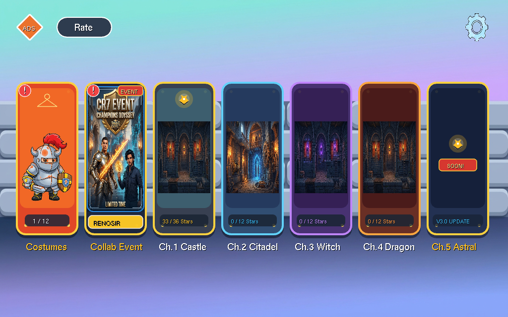
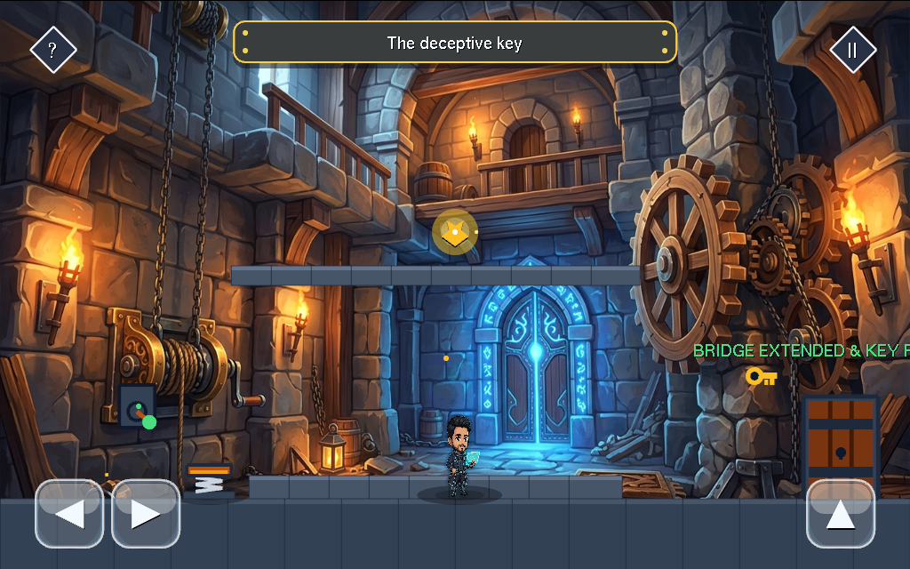
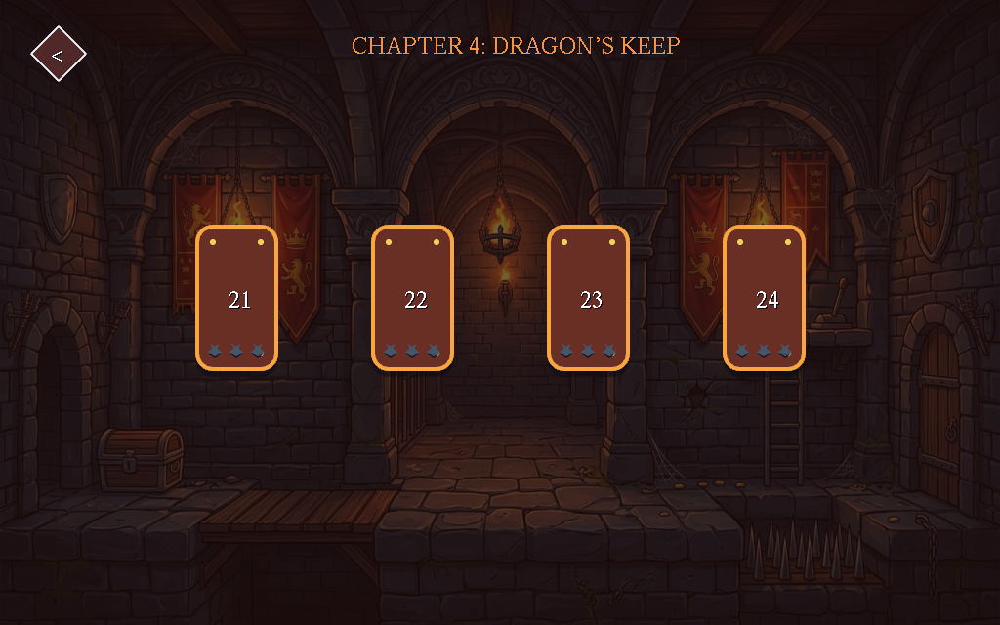
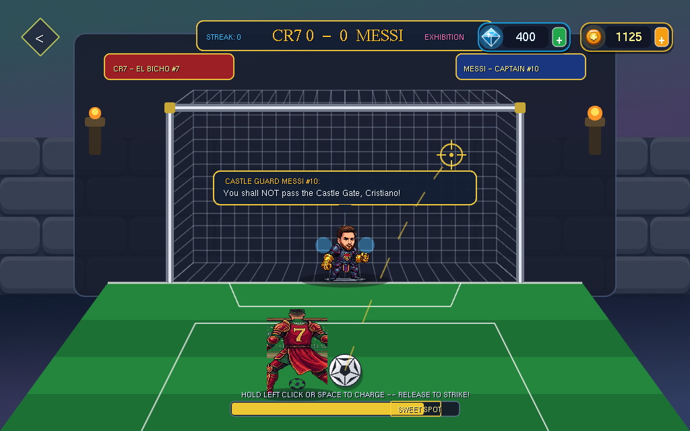
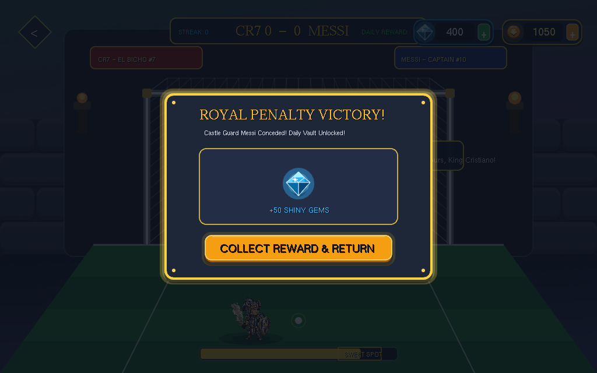
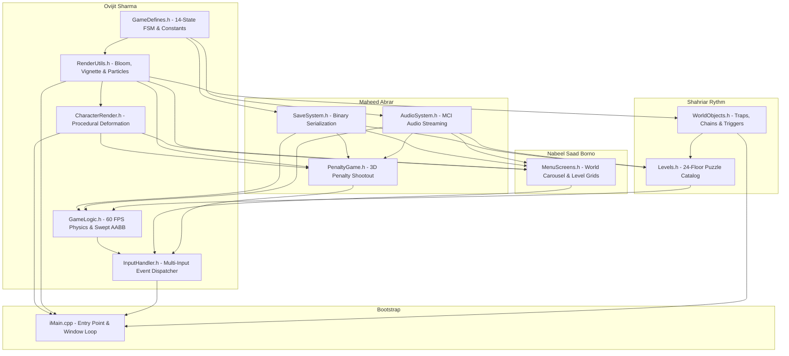

# Tricky Castle

A 2D puzzle-platformer and custom graphics engine implemented in C++ and OpenGL (`iGraphics`). Developed as the term project for **CSE-1200 (Software Development & Computer Graphics Lab)** at **Ahsanullah University of Science and Technology (AUST)**.

---

## Project Summary

Tricky Castle is an interactive puzzle-platformer centered on lateral problem solving and cognitive subversion. Players guide a knight through 24 medieval dungeon chambers across 4 chapters, navigating traps, dynamic obstacles, and puzzles designed to subvert conventional platforming assumptions (e.g., pushing locked doors directly, catching falling keys in mid-air, or manipulating HUD clue elements).

The project was constructed from the ground up using raw C++ and the fixed-function OpenGL pipeline (`iGraphics` framework over GLUT/GLU). Game systems—including physics, swept collision detection, procedural deformation, lighting shaders, and state handling—were written without external game engines (such as Unity or Unreal) to develop direct competence in low-level systems programming and real-time graphics.

---

## Technical Specifications

| Parameter | Specification |
|---|---|
| **Language** | C++14, C |
| **Graphics API** | OpenGL 2.1 / Fixed-Function Pipeline (`iGraphics`, GLUT, GLU) |
| **Platform** | Windows (Win32 API) |
| **Audio Subsystem** | Windows MCI (`winmm.lib`, `mciSendString`) |
| **Resolution** | 1024 × 640 @ 60 Hz |
| **Simulation** | Deterministic 60 FPS fixed-timestep Euler integration |
| **Collision Model** | Swept Axis-Aligned Bounding Box (AABB) with sub-pixel snapping |
| **Level Content** | 24 puzzle floors across 4 thematic castle chapters |
| **Architecture** | Decoupled modular design across 11 discrete header subsystems |

---

## Engineering Overview & My Contributions

As the lead developer responsible for **Game Theory, Physics Simulation, Graphics Architecture, and Procedural Animation**, my personal contribution encompasses **~3,800+ lines of C++** across [`GameLogic.h`](demo/GameLogic.h), [`CharacterRender.h`](demo/CharacterRender.h), [`RenderUtils.h`](demo/RenderUtils.h), [`InputHandler.h`](demo/InputHandler.h), and [`GameDefines.h`](demo/GameDefines.h).

### 1. Deterministic 60 FPS Physics Engine (`GameLogic.h`)
The simulation loop runs on a fixed timestep ($\Delta t = 16.67\text{ ms}$) rather than variable frame delta time. This guarantees identical jump parabolas, velocity damping, and collision resolution regardless of underlying CPU speed.

- **Euler Integration**: Computes horizontal velocity damping with friction coefficients ($0.82$ on ground, $0.94$ in air).
- **Parabolic Jump & Terminal Clamp**: Implements variable-height jumps with vertical velocity clamped to $v_{\max} = 14.0\text{ px/frame}$.
- **Swept AABB Collision Resolution**: Implements coordinate ray-sweeps and bounding-box checks with a 2px snap tolerance, resolving high-speed edge cases where fast-moving entities could tunnel through thin platform geometry or floor spikes.
- **Inertial Platform Mechanics**: Dynamically transfers momentum from moving stone platforms to the player entity.

### 2. Dual-Gravity Polarity Inversion
Certain puzzle floors (such as Floor 7: *Upside Down*) flip the world gravity vector:

$$\vec{g} = \pm 0.85 \hat{j}$$

- **Sensor Re-indexing**: Flips ground-checking sensors and ceiling head-bump raycasts dynamically between bottom and top boundaries.
- **Coordinate Matrix Inversion**: Transforms sprite vertices along the horizontal axis seamlessly, preventing coordinate clipping or phase-through bugs while maintaining intuitive left/right controller orientation.

### 3. Procedural Trigonometric Animation (`CharacterRender.h`)
To eliminate the memory footprint and asset pipeline overhead of multi-megabyte sprite sheets, all character deformations and animation states are evaluated analytically in real time:

- **Idle Breathing**: Sinusoidal chest scaling when stationary:
  $$\text{scale}_y = 1.0 + \sin(\omega t) \times 0.028, \quad \text{scale}_x = 1.0 - (\text{scale}_y - 1.0) \times 0.35$$
- **Stride Bobbing & Dynamic Tilt**: Stride oscillation modeled via $|\sin(\text{walkCycle} \times 0.20)| \times 4.0\text{ px}$ with forward body tilt ($\pm 5.5^\circ$) in the direction of velocity.
- **Squash and Stretch**: Dynamic deformation on jump liftoff ($\text{scale}_x = 0.90, \text{scale}_y = 1.12$) and landing impact ($\text{scale}_x = 1.18, \text{scale}_y = 0.82$) with exponential restoration decay.
- **Dynamic Occlusion Shadow**: Casts an elliptical ground shadow beneath the player whose radius and alpha scale inversely with elevation above the floor.

### 4. Custom 2D Lighting, Bloom & Vignette Shaders (`RenderUtils.h`)
Implemented hardware-accelerated visual styling on legacy OpenGL without requiring programmable GLSL shaders:

- **Multi-Pass Concentric Alpha Bloom (`drawGlowingText`)**: Simulates HDR glow on text and UI elements by issuing multi-pass draw calls at concentric offsets with decaying alpha blends (`GL_SRC_ALPHA`, `GL_ONE_MINUS_SRC_ALPHA`).
- **Radial Dark Vignette**: Procedural vignette overlays darkening screen perimeters to focus attention on the active puzzle stage.
- **Particle System**: A 280-particle pool with continuous recycling, simulating ambient torch embers, dust kicks, and reward sparkle bursts with pseudo-random velocity perturbations.

### 5. Finite State Machine & Controller Dispatcher (`GameDefines.h`, `InputHandler.h`)
- Designed the central 14-state game machine governing transitions across Intro, World Selection, Chapter Maps, In-Game Rooms, Pause Dialogs, Level Clear screens, and the Penalty Derby mini-game.
- Unified input architecture dispatching keyboard navigation, mouse hover/click interaction with environmental triggers (chains, levers, switches), and on-screen touch control buttons.

---

## Gameplay & Screenshots

### 1. World Selection & Visual Atmosphere
Pseudo-3D cylindrical carousel supporting real-time card depth scaling, vignette borders, and alpha-blended text.



### 2. Puzzle Chambers & Environmental Mechanics
Interactive drawbridges, ceiling pull-chains, dynamic torches, and spike pit hazards across castle floors.

| Floor 13: Drawbridge & Torch Lighting | Chapter 4: Dragon's Keep Map Grid |
|:---:|:---:|
|  |  |

### 3. Integrated Penalty Derby Mini-Game
Integrated football shootout mode featuring crosshair aiming, power gauge charging, 3D parabolic ball flight, goalkeeper AI, and animated celebration sequence.

| Crosshair Aiming & Depth Trajectory | Goal Celebration |
|:---:|:---:|
|  |  |

---

## System Architecture

The codebase follows a modular structure decoupling state simulation, input handling, and rendering pipelines:



### Module Responsibilities & Team Work Distribution

| Member | Student ID | Domain | Assigned Files | Scope | Primary Deliverables |
|---|---|---|---|:---:|---|
| **Ovijit Sharma** | `00725105101134` | **Physics Engine, Graphics Architecture, Procedural Animation & Game Theory** | [`CharacterRender.h`](demo/CharacterRender.h)<br/>[`RenderUtils.h`](demo/RenderUtils.h)<br/>[`GameLogic.h`](demo/GameLogic.h)<br/>[`InputHandler.h`](demo/InputHandler.h)<br/>[`GameDefines.h`](demo/GameDefines.h)<br/>[`iMain.cpp`](demo/iMain.cpp) | **~3,800+ lines** | 60 FPS Euler physics, swept AABB collision resolution, dual-gravity inversion tensor, procedural trigonometric animation pipeline, multi-pass concentric alpha bloom, dark vignette shading, and 14-state game FSM. |
| **Maheed Abrar** | `00725105101140` | **Systems & Mini-Game Development** | [`PenaltyGame.h`](demo/PenaltyGame.h)<br/>[`SaveSystem.h`](demo/SaveSystem.h)<br/>[`AudioSystem.h`](demo/AudioSystem.h) | **2,434 lines** | Standalone penalty shootout mode with 3D ball trajectory, goalkeeper AI, atomic binary serialization (`tricky_castle_save.dat`), and Windows MCI audio integration. |
| **Nabeel Saad Borno** | `00725105101135` | **User Interface & Score Management** | [`MenuScreens.h`](demo/MenuScreens.h)<br/>[`RenderUtils.h`](demo/RenderUtils.h) *(UI)* | **1,362 lines** | Cylindrical 3D world carousel, chapter map grids, character costume selection modal, star-rating evaluation, and animated toast alerts. |
| **Shahriar Rythm** | `00725105101132` | **Level Design & Dungeon Props** | [`Levels.h`](demo/Levels.h)<br/>[`WorldObjects.h`](demo/WorldObjects.h) | **1,127 lines** | 24 puzzle floors across Chapters 1-4, mechanical 3D button depress mechanics, interactive ceiling chains, levers, drawbridges, and hint solver. |

---

## Build and Execution

### Requirements
- **Operating System**: Windows 7 / 8 / 10 / 11 (32-bit or 64-bit)
- **Compiler / Toolchain**: Microsoft Visual Studio (2013, 2015, 2017, 2019, 2022) with the C++ Desktop Development workload
- **Graphics Hardware**: OpenGL 2.1 compatible GPU

### Compilation Steps
1. Clone the repository:
   ```bash
   git clone https://github.com/OVIJIT0844J/TrickyCastle.git
   cd TrickyCastle
   ```
2. Open `demo/TorchboundKeep.sln` (or `demo/demo.sln`) in Visual Studio.
3. Set the build configuration to **Debug** or **Release**, with platform targeted to **Win32** (x86).
4. Press **F5** (or **Ctrl + F5**) to compile and launch.
   - *All required OpenGL libraries (`GLUT32.DLL`, `glut32.lib`, `GLU32.LIB`, `glaux.lib`) are bundled in `demo/`.*

### In-Game Controls
- **A / D** or **Left / Right Arrow**: Move character horizontally
- **Space / W / Up Arrow**: Jump (variable height based on hold duration)
- **E / Left Click**: Interact with environmental triggers (chains, buttons, levers)
- **R**: Restart current puzzle room
- **H**: Reveal riddle clue
- **M**: Toggle background audio
- **Esc**: Pause / Return to Level Select / Main Menu

---

## Academic Documentation

The complete academic artifacts prepared for the university project submission are archived in the [`docs/`](docs/) directory:
- [Project Final Report (PDF)](docs/Castle_Escape_Project_Final_Report.pdf)
- [Individual Presentation Scripts (HTML)](docs/Castle_Escape_Individual_Presentation_Scripts.html)
- [Project Presentation Slide Deck (HTML)](docs/Castle_Escape_Presentation.html)
- [Architecture & Team Work Distribution Spec (MODULES.md)](docs/MODULES.md)

---

## License

This project is licensed under the [MIT License](LICENSE).
