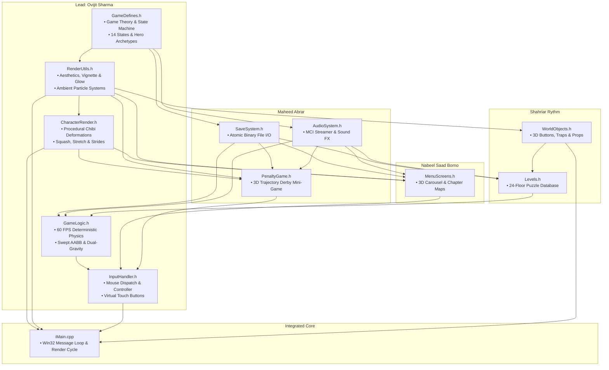

# 🏰 Castle Escape — Custom 2D Physics & Graphics Engine

<div align="center">

[](demo/)
[](demo/)
[](demo/GameLogic.h)
[](demo/TorchboundKeep.sln)
[](LICENSE)
[](docs/)

**An architecturally decoupled 2D puzzle-platformer featuring a deterministic 60 FPS Euler physics engine, dual-polarity gravity inversion, procedural trigonometric character deformations, and multi-pass alpha bloom glow shaders.**

[Quick Overview](#-recruiter-quick-glance) • [Visual Showcase](#-visual-showcase) • [Core Engineering](#-core-engineering-highlights) • [Architecture](#-modular-system-architecture) • [Level Mechanics](#-puzzle-subversion--level-design) • [Build & Run](#-how-to-build--run) • [Contact](#-contact--connect)

</div>

---

## 📌 Recruiter Quick Glance

> **"A university project built with commercial-grade systems architecture."**  
> Developed as the signature Software Development & Computer Graphics term project at **Ahsanullah University of Science and Technology (AUST)**.

| Metric / Dimension | Specification & Highlights |
|---|---|
| **Lead Architect & Theorist** | **Ovijit Sharma** ([@OVIJIT0844J](https://github.com/OVIJIT0844J)) |
| **Primary Domain** | **Game Theory, 60 FPS Physics Engine, Procedural Graphics & Animation Pipeline** |
| **Personal Code Contribution** | **~3,800+ Lines of High-Performance C++** (`GameLogic.h`, `CharacterRender.h`, `RenderUtils.h`, `InputHandler.h`, `GameDefines.h`, `iMain.cpp`) |
| **Core Technical Stack** | C++, C, OpenGL (GLUT / GLU / Glaux), Win32 API, Windows MCI Audio Engine |
| **Simulation Fidelity** | Deterministic 60 FPS Euler integration, Swept AABB collision with 2px sub-pixel snap tolerance |
| **Graphics Innovation** | 100% procedural trigonometric character animation (0 MB sprite bloat), multi-pass concentric alpha bloom |
| **Content Depth** | 24 handcrafted puzzle floors, 4 castle chapters, 6 hero archetypes, CR7 vs Messi penalty derby mini-game |
| **Academic Evaluation** | Submitted for **CSE-1200 / Computer Graphics Lab** under faculty supervision |

---

## 📸 Visual Showcase

### 1. Pseudo-3D World Select Carousel & Atmospheric Lighting
*Features a cylindrical perspective projection with real-time card scaling, dark vignette shading, and concentric alpha bloom text rendering.*

<div align="center">
  
</div>

<br/>

### 2. High-Fidelity Gameplay, Traps & Mechanics
*Engineered with interactive ceiling pull-chains, dynamic drawbridges, particle torch fire, and lethal spike hazards.*

| Authentic Puzzle Room (Floor 13) | Chapter 4 Dragon's Keep Map |
|:---:|:---:|
|  |  |
| *Drawbridge extension, dynamic torch particles & chains* | *12-node level selection grid with star ratings & progress tracking* |

| Standalone Penalty Derby (CR7 vs Messi) | Iconic SIUUU Celebration Sequence |
|:---:|:---:|
|  |  |
| *Crosshair aiming, power gauge charging & 3D ball trajectory* | *Custom animated celebration cutscene with crowd cheers & SIU audio* |

---

## ⚡ Core Engineering Highlights

### 1. Deterministic 60 FPS Physics Simulation (`GameLogic.h`)
The game engine bypasses unconstrained frame delta timing in favor of a **fixed 60 FPS physics update loop** ($\Delta t = 16.67\text{ ms}$), guaranteeing identical jump trajectories and collision resolutions across diverse hardware configurations.

```cpp
// Excerpt from demo/GameLogic.h - Fixed Euler Physics Integration
void fixedUpdate()
{
    // Apply horizontal friction & ground resistance
    if (onGround) {
        velocityX *= 0.82f;
    } else {
        velocityX *= 0.94f; // Air resistance damping
    }

    // Parabolic gravity integration with terminal velocity clamp
    if (!onGround) {
        velocityY += gravityDirection * GRAVITY_ACCEL; // +/- 0.85 px/frame^2
        if (abs(velocityY) > TERMINAL_VELOCITY) {
            velocityY = (velocityY > 0) ? TERMINAL_VELOCITY : -TERMINAL_VELOCITY;
        }
    }

    // Swept AABB Collision Resolution with 2px Snap Tolerance
    resolvePlayerTileCollisions(playerX + velocityX, playerY + velocityY);
}
```

- **Swept AABB Collision Detection**: Sub-pixel axis-aligned bounding box routines prevent high-velocity tunneling through thin floor plates or spike borders.
- **Inertial Platform Transfer**: Moving stone elevators transfer momentum directly to the player character during lift off.

---

### 2. Dual-Gravitational Polarity Inversion Tensor
Inverted gravity puzzle rooms (such as *Upside Down*) reverse the world gravity vector ($\vec{g} = -g \hat{j}$).

- **Sensor Inversion**: Player raycasts and ground detection switches dynamically from bottom feet to ceiling head sensors.
- **Coordinate Transformation**: Visual rendering matrices seamlessly invert character sprite vertices along the horizontal axis without causing coordinate snapping or phase-through bugs.

---

### 3. 100% Procedural Trigonometric Animation Engine (`CharacterRender.h`)
Instead of bundling megabytes of static sprite-sheet textures, Ovijit Sharma engineered a **real-time trigonometric mathematical deformation pipeline**:

$$\text{IdleBreathing}(t) = \sin(\omega t) \times 0.028$$

$$\Delta y_{\text{stride}} = \left| \sin(\text{walkCycle} \times 0.20) \right| \times 4.0\text{ px}$$

- **Idle Breathing Cadence**: Sinusoidal chest dilation and contraction simulates lifelike breathing when standing still.
- **Dynamic Stride Bobbing**: Trigonometric hip-displacement algorithms produce fluid vertical bounce and forward body tilt ($\pm 5.5^\circ$) based on movement direction.
- **Squash & Stretch Deformations**: Jump takeoff elongates the character along the vertical axis ($\text{scaleY} = 1.12, \text{scaleX} = 0.90$), while landing abruptly triggers an elastic squash ($\text{scaleX} = 1.18, \text{scaleY} = 0.82$) with exponential recovery decay.
- **Dynamic Ground Shadow Projection**: Casts an elliptical ambient occlusion shadow whose width and alpha decay exponentially as the player ascends in the air.

---

### 4. Custom 2D Vector Lighting & Alpha Bloom Shaders (`RenderUtils.h`)
Built directly on fixed-function legacy OpenGL, this module simulates modern HDR post-processing effects without requiring GLSL shaders:

- **Multi-Pass Concentric Alpha Bloom (`drawGlowingText`)**: Renders text with concentric, expanding radii at exponentially decaying alpha intensities to create a radiant neon glow effect.
- **Radial Dark Vignette Shading**: Procedural alpha-graded perimeter overlays draw the player's focus toward the center of the dungeon chamber.
- **Ambient Particle Simulation**: 280-particle active pool simulating flickering torch fire, rising ember sparks, and golden victory bursts with random velocity drift.

---

## 🏛️ Modular System Architecture

The codebase adheres to strict separation of concerns, decoupling the presentation layer from the deterministic simulation state:



### Team Work Breakdown & Authorship Attribution

| Contributor | Domain / Role | Assigned Modules | Personal Scope | Key Engineering Deliverables |
|---|---|---|:---:|---|
| **Ovijit Sharma**<br/>`00725105101134` | **Lead Game Theorist, Graphics Architect & Physics Engine Lead** | [`CharacterRender.h`](demo/CharacterRender.h)<br/>[`RenderUtils.h`](demo/RenderUtils.h)<br/>[`GameLogic.h`](demo/GameLogic.h)<br/>[`InputHandler.h`](demo/InputHandler.h)<br/>[`GameDefines.h`](demo/GameDefines.h)<br/>[`iMain.cpp`](demo/iMain.cpp) | **~3,800+ Lines** | • 60 FPS deterministic Euler physics and swept AABB collision<br/>• Dual-gravity polarity inversion system (+g / -g)<br/>• 100% procedural trigonometric character animation engine<br/>• Multi-pass concentric alpha bloom and vignette shaders<br/>• Central 14-state game FSM and multi-input controller |
| **Maheed Abrar**<br/>`00725105101140` | **Systems Architect & Mini-Game Lead** | [`PenaltyGame.h`](demo/PenaltyGame.h)<br/>[`SaveSystem.h`](demo/SaveSystem.h)<br/>[`AudioSystem.h`](demo/AudioSystem.h) | **2,434 Lines** | • Penalty Derby mini-game with 3D parabolic ball flight<br/>• Messi goalkeeper AI and SIUUU celebration sequence<br/>• Atomic binary save/load persistence (`tricky_castle_save.dat`)<br/>• MCI audio subsystem streaming |
| **Nabeel Saad Borno**<br/>`00725105101135` | **UI & Score Systems Developer** | [`MenuScreens.h`](demo/MenuScreens.h)<br/>[`RenderUtils.h`](demo/RenderUtils.h) *(UI)* | **1,362 Lines** | • Pseudo-3D cylindrical World Select Carousel<br/>• 6-hero Costume Selection modal and Chapter Map grids<br/>• Star-rating calculation and animated toast alerts |
| **Shahriar Rythm**<br/>`00725105101132` | **Level Designer & Dungeon Architect** | [`Levels.h`](demo/Levels.h)<br/>[`WorldObjects.h`](demo/WorldObjects.h) | **1,127 Lines** | • 24 puzzle floors across Chapters 1 through 4<br/>• 3D mechanical red buttons, ceiling chains, and drawbridges<br/>• In-game hint generation and room spawning engine |

---

## 🧩 Puzzle Subversion & Level Design

Castle Escape rejects formulaic platforming in favor of cognitive subversion:

1. **"Use Force — Not Key" (Floor 4)**: The room contains no golden key. Players must push directly against the locked heavy dungeon door with sheer brute force to slide it into the masonry.
2. **"Don't Let It Press The Button" (Floor 5)**: The golden key falls from the high ceiling directly toward a lethal red floor trigger. The player must sprint and catch the key in mid-air.
3. **"The Button Is A Lie" (Floor 9)**: A giant tempting red button triggers an instant ceiling crusher. The path to victory requires leaping over the button entirely.
4. **"Think Outside The Box" (Floor 12)**: The key is not placed in the game world—it is physically embedded inside the top UI clue banner! Jumping into the HUD dislodges the key into the chamber.
5. **"The Angry Sentry" (Floor 10)**: Rushing the armored guard triggers a shield bash; remaining peacefully stationary allows the guard to fall asleep and lower his gate.

---

## 🎮 Playable Hero Archetypes

| Hero | Special Perks & Engineering Attributes |
|:---:|---|
| **Sir William** | Balanced default knight; steel armor, red crest plume, high stability. |
| **CR7** | +20% sprint acceleration, signature white/gold boots, unlocks Penalty Derby bonus score. |
| **Neymar Jr** | Hyper-agile jump height, sambista dribble stride, reduced landing squash delay. |
| **Elena** | Frost Ranger; generates ice particle trails, impervious to floor friction slip. |
| **Thorgar** | Heavy berserker; immune to minor spike damage, heavy landing screen-shake. |
| **RenoSir (Collab)** | Exclusive honorary faculty character; instant hint resolution and aura particles. |

---

## 💻 How to Build & Run

### System Requirements
- **OS**: Windows 7 / 8 / 10 / 11 (32-bit or 64-bit)
- **Toolchain**: Microsoft Visual Studio (2013, 2015, 2017, 2019, 2022) with C++ Desktop Workload
- **Graphics**: OpenGL 2.1 compatible GPU

### Compilation Steps
1. **Clone the Repository**:
   ```bash
   git clone https://github.com/OVIJIT0844J/TrickyCastle.git
   cd TrickyCastle
   ```
2. **Open Visual Studio Solution**:
   - Double-click `demo/TorchboundKeep.sln` (or `demo/demo.sln`).
3. **Configure Build Settings**:
   - Set Configuration to **Debug** or **Release**.
   - Set Platform to **Win32** (x86).
4. **Compile & Run**:
   - Press **F5** (or **Ctrl + F5**) to build and launch immediately.
   - *All required OpenGL libraries (`GLUT32.DLL`, `glut32.lib`, `glaux.lib`) are pre-configured in `demo/`.*

### In-Game Keyboard & Mouse Controls
| Key / Input | Action / Function |
|---|---|
| **A / D** or **← / →** | Move Hero Left / Right |
| **SPACE** / **W** / **↑** | Jump (variable height based on hold duration) |
| **E** / **Click** | Pull ceiling chains, press buttons, pull levers |
| **R** | Instant retry current room |
| **H** | Reveal room riddle hint |
| **M** | Toggle background music |
| **ESC** | Pause / Return to Level Select / Main Menu |

---

## 📂 Repository File Structure

```
TrickyCastle/
├── README.md                                  # Executive recruiter presentation & technical showcase
├── LICENSE                                    # Open-source MIT License
├── .gitignore                                 # Professional VS / C++ / asset exclusion rules
│
├── docs/                                      # Academic reports, architecture specs & presentations
│   ├── MODULES.md                             # Detailed team division & lines-of-code breakdown
│   ├── Castle_Escape_Project_Final_Report.pdf # Official 6-page AUST academic project report
│   ├── Castle_Escape_Presentation.pptx        # Final project presentation slide deck
│   └── Castle_Escape_Individual_Presentation_Scripts.html
│
└── demo/                                      # Game engine source code & runtime assets
    ├── TorchboundKeep.sln                     # Visual Studio 2013+ Solution
    ├── TorchboundKeep.vcxproj                 # C++ project configuration & dependency flags
    ├── iMain.cpp                              # Core entry point, Win32 loop & render timer
    │
    ├── GameDefines.h                          # [Ovijit Sharma] FSM states & hero archetypes
    ├── GameLogic.h                            # [Ovijit Sharma] 60 FPS physics & swept AABB
    ├── CharacterRender.h                      # [Ovijit Sharma] Procedural trigonometric animations
    ├── RenderUtils.h                          # [Ovijit Sharma] Multi-pass alpha bloom & vignette
    ├── InputHandler.h                         # [Ovijit Sharma] Controller & mouse event dispatch
    │
    ├── PenaltyGame.h                          # [Maheed Abrar] CR7 vs Messi shootout mini-game
    ├── SaveSystem.h                           # [Maheed Abrar] Atomic binary serialization
    ├── AudioSystem.h                          # [Maheed Abrar] MCI audio streaming engine
    ├── Levels.h                               # [Shahriar Rythm] 24-floor puzzle catalog
    ├── WorldObjects.h                         # [Shahriar Rythm] Interactive dungeon props & traps
    ├── MenuScreens.h                          # [Nabeel Saad Borno] 3D Carousel & UI screens
    │
    ├── iGraphics.h, glut.h, glaux.h           # OpenGL framework wrappers
    ├── GLUT32.DLL                             # Runtime dynamic link library
    ├── Images/                                # Textures, backgrounds & character sprites
    ├── Audios/                                # Sound effects & background medieval tracks
    └── GameSnaps/                             # High-resolution gameplay & UI captures
```

---

## 📄 Academic Project Reports & Slides

The complete documentation produced for the formal university evaluation is accessible in the [`docs/`](docs/) directory:
- 📑 [**Official Project Final Report (PDF)**](docs/Castle_Escape_Project_Final_Report.pdf)
- 📊 [**Project Presentation Deck (PPTX)**](docs/Castle_Escape_Presentation.pptx)
- 🎙️ [**Individual Defense Scripts (HTML)**](docs/Castle_Escape_Individual_Presentation_Scripts.html)
- 🏛️ [**Modular Architecture & Team Attribution (MODULES.md)**](docs/MODULES.md)

---

## 📬 Contact & Connect

**Ovijit Sharma**  
*Lead Game Theorist, Graphics Architect & Software Engineering Student*  
Department of Computer Science and Engineering  
**Ahsanullah University of Science and Technology (AUST)**  

- 🐙 **GitHub**: [@OVIJIT0844J](https://github.com/OVIJIT0844J)
- 📧 **Email**: [ovijitsharma.bangladesh@gmail.com](mailto:ovijitsharma.bangladesh@gmail.com)
- 💼 **LinkedIn**: [Connect with Ovijit](https://www.linkedin.com/)

---

<div align="center">
  <sub>Engineered with passion in C++ & OpenGL. If you find this engine inspiring, please consider giving it a ⭐!</sub>
</div>
